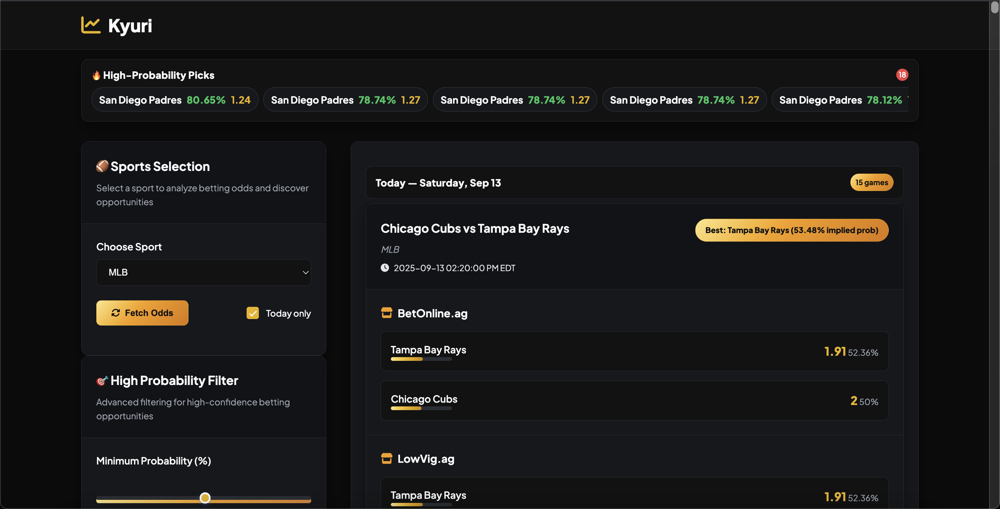

# Sports Analytics Platform



Advanced real-time sports analytics platform with multi-API integration, statistical modeling, automated notifications, and comprehensive data visualization capabilities.


## 🚀 Features

- **Real-Time Data Processing**: Live sports odds and statistics from multiple APIs
- **Multi-API Integration**: Seamless integration with The Odds API and NBA Stats API
- **Advanced Analytics**: Statistical modeling and performance analysis
- **Automated Notifications**: Email and SMS alerts via Twilio integration
- **Data Visualization**: Performance charts and analytics dashboards
- **Responsive Web Interface**: Modern Flask-based web application
- **Database Management**: SQLite integration for data persistence
- **Error Handling**: Robust API management with failover mechanisms

## 🛠 Tech Stack

### Backend

- **Python 3.8+**: Core application logic
- **Flask**: Web framework and API endpoints
- **SQLite**: Database for data persistence
- **Requests**: HTTP client for API integration

### Data & Analytics

- **Pandas**: Data manipulation and analysis
- **NumPy**: Numerical computing
- **Matplotlib**: Data visualization and charting
- **PyTZ**: Timezone management

### Integrations

- **The Odds API**: Real-time sports odds data
- **NBA Stats API**: Professional basketball statistics
- **Twilio**: SMS notification service
- **SMTP**: Email notification system

### UI/UX

- **Jinja2**: Template engine
- **HTML/CSS/JavaScript**: Frontend interface
- **Rich Console**: Enhanced terminal output
- **Colorama**: Cross-platform colored terminal text

## 📊 Core Capabilities

### Data Aggregation

- Multi-sport odds tracking (NBA, NFL, Tennis, etc.)
- Real-time data synchronization
- Historical data storage and analysis
- API rate limiting and caching

### Analytics Engine

- Statistical modeling and trend analysis
- Performance tracking and reporting
- Data visualization and charting
- Historical comparison tools

### Notification System

- Real-time email alerts for odds changes
- SMS notifications via Twilio
- Customizable alert thresholds
- Multi-user notification management

### Web Interface

- Interactive dashboard for data exploration
- Real-time odds display and updates
- Historical performance charts
- User preference management

## ⚡ Quick Start

### Prerequisites

```bash
Python 3.8+
pip package manager
```

### Installation

```bash
# Clone the repository
git clone https://github.com/YOUR_USERNAME/sports-analytics-platform.git
cd sports-analytics-platform

# Install dependencies
pip install -r requirements.txt

# Set up environment variables
cp .env.example .env
# Edit .env with your API keys and configuration
```

### Configuration

1. **API Keys**: Obtain keys from The Odds API and RapidAPI
2. **Email Setup**: Configure SMTP settings for notifications
3. **Twilio Setup**: Add Twilio credentials for SMS alerts
4. **Database**: SQLite database will be created automatically

### Running the Application

```bash
# Start the Flask web server
python app.py

# Access the application at http://localhost:5000
```

## 🔧 Configuration

### Environment Variables

```bash
# API Configuration
ODDS_API_KEY=your_odds_api_key
NBA_API_KEY=your_nba_api_key

# Email Configuration
EMAIL_ADDRESS=your_gmail@gmail.com
EMAIL_PASSWORD=your_app_password

# Twilio Configuration (Optional)
TWILIO_ACCOUNT_SID=your_twilio_sid
TWILIO_AUTH_TOKEN=your_twilio_token
TWILIO_PHONE_NUMBER=your_twilio_number
```

### Supported Sports

- Basketball (NBA)
- American Football (NFL)
- Tennis (ATP/WTA Tours)
- Hockey (NHL)
- Baseball (MLB)
- Soccer (Premier League, Champions League)

## 📈 Architecture

### Data Flow

1. **API Integration**: Fetch real-time data from multiple sources
2. **Data Processing**: Clean, normalize, and analyze incoming data
3. **Storage**: Persist data in SQLite database
4. **Analytics**: Generate insights and statistical models
5. **Notifications**: Alert users based on configured thresholds
6. **Visualization**: Present data through web interface

### Key Components

- **Flask Web Server**: Handles HTTP requests and renders templates
- **Data Manager**: Orchestrates API calls and data processing
- **Analytics Engine**: Performs statistical analysis and modeling
- **Notification System**: Manages email and SMS alerts
- **Database Layer**: Handles data persistence and queries

## 🔒 Security & Privacy

- API key management through environment variables
- Secure SMTP authentication for email notifications
- Input validation and sanitization
- Error handling without sensitive data exposure
- Local data storage (no cloud dependencies)

## 📊 Use Cases

### Professional Applications

- **Sports Analytics Research**: Academic and professional sports analysis
- **Data Science Projects**: Real-time data processing and visualization
- **API Integration Demonstrations**: Multi-source data aggregation
- **Full-Stack Development Showcase**: Complete web application architecture

### Technical Demonstrations

- Real-time data streaming and processing
- Multi-API orchestration and error handling
- Statistical modeling and data visualization
- Notification system architecture
- Database design and management

## 🤝 Contributing

This project demonstrates advanced Python development, API integration, and data analysis capabilities. It serves as a comprehensive example of:

- Full-stack web application development
- Real-time data processing systems
- Multi-API integration and management
- Statistical analysis and visualization
- Professional software architecture

## ⚠️ Financial Disclaimer

**IMPORTANT NOTICE**: This software is designed for **educational, research, and demonstration purposes only**. 

- This platform is **NOT intended for actual financial betting or gambling**
- The software provides data analysis and visualization tools for **educational purposes**
- Users should **NOT use this software for real money wagering** or financial decisions
- The developer **assumes NO responsibility** for any financial losses or legal issues
- **Sports betting may be illegal** in your jurisdiction - consult local laws
- This project demonstrates **technical capabilities only** - not financial advice
- All data and analysis should be considered **for educational demonstration only**

**Use this software responsibly and in compliance with your local laws.**

## 📄 License

This project is licensed under the MIT License - see the LICENSE file for details.

## 🏗 Future Enhancements

- Machine learning prediction models
- Advanced statistical analysis tools
- Mobile responsive design improvements
- Additional sports and data sources
- Enhanced visualization capabilities
- Real-time WebSocket integration

---

**Developed by Mazen Alhassan** - Full-Stack Developer & Data Analyst

_This project showcases advanced Python development, API integration, real-time data processing, and comprehensive system architecture._
